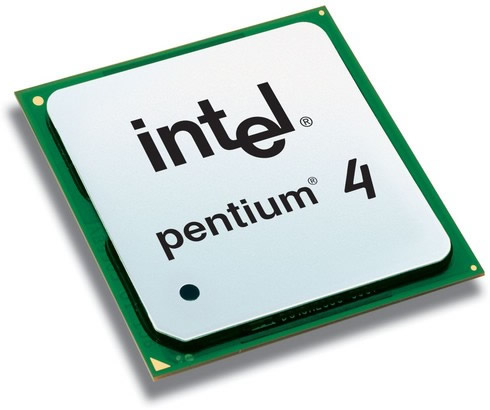
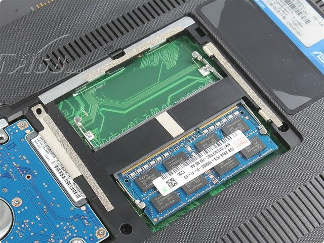

不管是台式机还是笔记本，它们内部都有一块电路板，上面密密麻麻地布满了大小不一的电子器件，包括CPU、内存条、网卡、各种插槽和接口等，这就是“主板”，如下图所示。

这张图片主要让读者了解主板的构造，你不必理解图片中各个晦涩的名词。

图1：计算机主板CPU

CPU (Central Processing Unit) 就是“中央处理器”，是计算机的大脑，负责计算、思考、处理数据、控制其他设备等，没有CPU，计算机就无从谈起，CPU的速度直接决定了电脑的运行速度。如下图所示：

图2：CPU

目前市场上常见的应用于台式机和笔记本的CPU有 Intel(英特尔) 和 AMD(超微半导体公司)，Intel 性能好一点，占据了大部分份额。

关于CPU的位数，我们将在《[C语言和内存](http://c.biancheng.net/cpp/u/c20/)》中的《[虚拟地址空间以及编译模式](http://c.biancheng.net/cpp/html/3188.html)》一节讲解。CPU有很多针脚，直接插在主板上，如下图所示：

图3：CPU插槽内存内存就是下面的长方形“卡片”，也叫内存条。

图4：内存条

我们常说电脑有几个G的内存，就是指它的大小，市面上常见的有2G、4G、8G等。

C语言程序必须加载到内存才能运行，CPU 也被设计为只能从内存中读取数据和指令，一名不了解内存的程序员，注定无法彻底理解程序的运行原理，不能让自己的编程水平有一个质的飞越，因此我们特地增加了《[C语言和内存](http://c.biancheng.net/cpp/u/c20/)》专题，让大家彻底明白内存，并运用到实际编程中。内存条插在主板上的特定插槽内，如下所示是台式机的内存插槽：

图5：台式机内存插槽

不过笔记本为了节省空间，一般将内存条平放，如下所示：

图6：笔记本内存插槽

主板上一般有多个内存插槽，可以插多个内存条，电脑内存大小是所有内存条大小之和。内存条也被称为主存。硬盘硬盘是用来保存数据的。打开一个文件，编辑完成后，Ctrl+S 就保存到了硬盘，断电不会丢失。硬盘分为机械硬盘(HDD)和固态硬盘(SSD)。

机械硬盘就像VCD或DVD，由一个精密电机带动光盘快速转动来让探头读取和写入数据。如下图所示：

图7：机械硬盘

固态硬盘就像手机内存卡或U盘，内部有上亿个电子元器件，非常细小，达到纳米级别，通过电路来读取和写入数据。如下图所示：

图8：固态硬盘

与机械硬盘相比，固态硬盘在读写速度上有很大优势，一个很明显的例子就是电脑安装了固态硬盘开机速度很快，很少出现卡顿的现象。

硬盘不是直接插在主板上，而是通过导线与主板相连，所以叫外部存储，也是电脑外设的一部分，不过不像鼠标、键盘、U盘等，没有也可以正常工作，硬盘是电脑正常运行所必需的外部设备。协调CPU、内存、硬盘等部件不能各自为战，它们通过主板连接在一起，由CPU控制，协调工作。