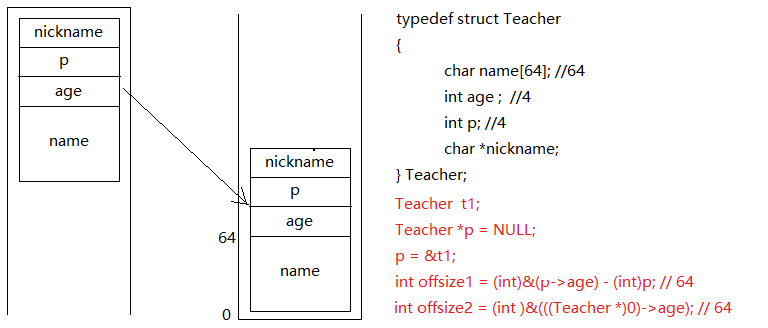
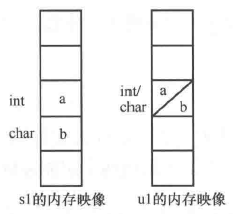

### 结构体变量的内存分配

结构体变量占据的内存大小是按照字节对齐的机制来分配的

### 字节对齐

结构体字节对齐存储的原因是符合内存硬件的特性，访问速度性能高，但是牺牲了内存空间

32位编译器，一般编译器默认对齐方式是4字节对齐

结构体变量占据的内存单元的个数应当大于等于其内部所有数据成员占据内存单元数的和。

出于效率的考虑，C语言引入了字节对齐机制，一般来说，不同的编译器字节对齐机制有所不同，但还是有以下3条通用准则：
（1）结构体变量的大小能够被其最宽基本类型成员的大小所整除；
（2）结构体每个成员相对于结构体首地址的偏移量（offset）都是成员大小的整数倍，如有需要编译器会在成员之间加上填充字节（internal adding）；
（3）结构体的总大小为结构体最宽基本类型成员大小的整数倍，如有需要编译器会在最末一个成员之后加上填充字节（trailing padding）。

字节对齐第3条准则提及最宽基本类型的概念，所谓基本类型是指像char、short、int、float、double这样的内置数据类型。“数据宽度”就是指其sizeof的大小。诸如结构体、共用体和数组等都不是基本数据类型

```c
struct {
	char a;
	double b;
	int c;
	short d;
} s;
```

- 地址偏移量是成员变量的基本数据类型的整数倍


- 结构体变量的总大小是结构体最宽基本类型成员大小的整数倍


```c
#include<stdio.h>
#include<stddef.h>

/* Offset of member MEMBER in a struct of type TYPE. */
// #define offsetof(TYPE, MEMBER) __builtin_offsetof (TYPE, MEMBER)
// #define offsetof(TYPE, MEMBER) ((size_t) &((TYPE *)0)->MEMBER)

typedef struct Test{
	char a;
	double b;
	int c;
	short d;
} Test;

int main(){
	
	printf("%d \n",offsetof(Test,a)); // 0
	printf("%d \n",offsetof(Test,b)); // 8
	printf("%d \n",offsetof(Test,c)); // 16
	printf("%d \n",offsetof(Test,d)); // 20
	
	return 0;
}
```

结构体中成员的地址相对于结构体首地址的偏移量

```c
typedef struct AdvTeacher
{
	char name[64]; //64
	int age ;  //4
	int p; //4
	char *pname2;
}AdvTeacher;

void main()
{
	int i = 0;
	AdvTeacher  t1; // & (t1.age)
	AdvTeacher *p = NULL;
	p = &t1;
	{
		int offsize1 = (int)&(p->age) - (int)p; // & (t1.age)
		int offsize2 = (int )&(((AdvTeacher *)0)->age); 
		printf("offsize1:%d \n", offsize1); // 64
		printf("offsize2:%d \n", offsize2); // 64
	}

	system("pause");
	return ;
}
```

把t1的内存空间映射到0地址处开始的地方



### 结构体指针

```c
struct Student s；
struct Student *p = &s;
printf("%s\n", p->name);
```

### union

允许多个成员使用同一块内存，同一个内存空间有多种解释方式，union中的元素不存在内存对齐的问题

```c
struct mystruct {
  	int a;
  	char b;
}
union myunion{
  	int a;
  	char b;
}
int main(void){
  	struct mystruct s1;
  	s1.a = 23;
  	printf("s1.b = %d.\n", s1.b); // s1.b = 0
  	myunion u1;
  	u1.a = 23;
  	printf("u1.b = %d.\n", u1.b); // u1.b = 23
  	// a 和 b 的地址一样，充分说明 a 和 b 指向同一块内存
  	// 只是对这一块内存的解析规则有所不同
  	return 0;
}
```



### typedef —— 给数据类型取别名 

```c
typedef struct Student{
  	int age;
  	char name[10];
} STU;
STU student;
```
### 结构体的浅拷贝和深拷贝

```c
typedef struct Teacher
{
	char name[64];
	int age ;
	char *pname2;
}Teacher;

//编译器的=号操作,只会把指针变量的值,从from  copy 到 to, 
//但不会把指针变量所指的 内存空间 给copy过去//浅copy

//结构体中套一个 1级指针 或 2级指针 
//如果想执行深copy,再显式的分配内存
void copyTeacher(Teacher *to, Teacher *from)
{
	*to = *from;
	to->pname2 = (char *)malloc(100);
	strcpy(to->pname2, from->pname2);
	//memcpy(to, from , sizeof(Teacher));
}
void main51()
{
	Teacher t1;
	Teacher t2;

	strcpy(t1.name, "name1");
	t1.pname2 = (char *)malloc(100);
	strcpy(t1.pname2, "ssss");

	//t1 copy t2
	copyTeacher(&t2, &t1);

	if (t1.pname2 != NULL)
	{
		free(t1.pname2);
		t1.pname2 = NULL;
	}

	if (t2.pname2 != NULL)
	{
		free(t2.pname2);
		t2.pname2 = NULL;
	}

	system("pause");
	return ;
}
```
### 大小端模式

大端模式：高字节对应低地址

小端模式：高字节对应高地址