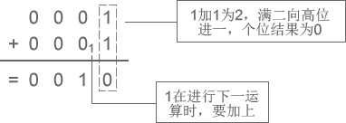
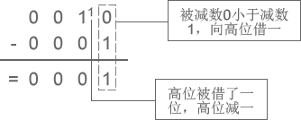

我们平时使用的数字都是由 0~9 共十个数字组成的，例如 1、9、10、297、952 等，一个数字最多能表示九，如果要表示十、十一、二十九、一百等，就需要多个数字组合起来。

例如表示 5+8 的结果，一个数字不够，只能”进位“，用 13 来表示；这时”进一位“相当于十，”进两位“相当于二十。

因为逢十进一，也因为只有 0~9 共十个数字，所以叫做十进制（Decimalism）。

进制也就是进位制。在进行加法（减法）运算时，逢X进（借）一就是X进制，这种进制也就包含X个数字，基数为X。十进制有0~9共10个数字，基数为10，在加减法运算中，逢十进一，借一当十。

我们不妨将思维拓展一下，既然可以用 0~9 共十个数字来表示数值，那么也可以用0、1两个数字来表示数值，这就是二进制（Binary）。

## 二进制思想

二进制只有0和1两个数字，基数为2，在加减法运算中，逢二进一，借一当二。

- 表示数值：0、1、10、111、100、1000001
- 加法：1+0=1、1+1=10、10+110=1000、111+111=1110
- 减法：1-0=1、10-1=1、100-11=1、1010-101=101

十进制与二进制的对应关系

二进制和十进制的转换：

- 十进制 4321 = 4×103 + 3×102 + 2×101 + 1×100
- 二进制 1101 = 1×23 + 1×22 + 0×21 + 1×20 = 8 + 4 + 0 + 1 = 13
- 二进制 110.11 = 1×22 + 1×21 + 0×20 + 1×2-1 + 1×2-2 = 4 + 2 + 0 + 0.5 + 0.25 = 6.75

如果你希望详细了解二进制加减法的运算过程，我们提供了两张示意图。这是选学内容，你完全可以跳过，不会影响后面的学习。

1) 二进制加法：0001 + 0001 = 0010

图1：二进制加法

2) 二进制减法：0010 - 0001 = 0001

图2：二进制减法

在内存中，数据就是以二进制的形式存储的。内存中数据的存储计算机要处理的信息是多种多样的，如十进制数、文字、符号、图形、音频、视频等，这些信息在人们的眼里是不同的。但对于计算机来说，它们在内存中都是一样的，都是以二进制的形式来表示。

要想学习编程，就必须了解二进制，它是计算机处理数据的基础。

内存条是一个非常精密的部件，包含了上亿个电子元器件，它们很小，达到了纳米级别。这些元器件，实际上就是电路；电路的电压会变化，要么是 0V，要么是 5V，只有这两种电压。5V 是通电，用1来表示，0V 是断电，用0来表示。所以，一个元器件有2种状态，0 或者 1。

我们通过电路来控制这些元器件的通断电，会得到很多0、1的组合。例如，8个元器件有 28=256 种不同的组合，16个元器件有 216=65536 种不同的组合。虽然一个元器件只能表示2个数值，但是多个结合起来就可以表示很多数值了。

我们可以给每一种组合赋予特定的含义，例如，可以分别用 1101000、00011100、11111111、00000000、01010101、10101010 来表示 C、语、言、中、文、网 这几个字，那么结合起来 1101000 00011100 11111111 00000000 01010101 10101010 就表示”C语言中文网“。

一般情况下我们不一个一个的使用元器件，而是将8个元器件看做一个单位，即使表示很小的数，例如 1，也需要8个，也就是 00000001。

1个元器件称为1比特（Bit）或1位，8个元器件称为1字节（Byte），那么16个元器件就是2Byte，32个就是4Byte，以此类推：8×1024个元器件就是1024Byte，简写为1KB；8×1024×1024个元器件就是1024KB，简写为1MB；8×1024×1024×1024个元器件就是1024MB，简写为1GB。
现在，你知道1GB的内存有多少个元器件了吧。我们通常所说的文件大小是多少KB、多少MB，就是这个意思。

单位换算：8 Bit = 1Byte1024Byte = 1KB1024KB = 1MB1024MB = 1GB1024GB = 1TB
你看，在内存中没有abc这样的字符，也没有gif、jpg这样的图片，只有0和1两个数字，计算机也只认识0和1。所以，计算机使用二进制，而不是我们熟悉的十进制，写入内存中的数据，都会被转换成0和1的组合。

我们将在《[C语言调试](http://c.biancheng.net/cpp/u/c23/)》中的《[查看、修改运行时的内存](http://c.biancheng.net/cpp/html/3132.html)》一节教大家如何操作C语言程序的内存。程序员的幽默为了加深印象，最后给大家看个笑话。

程序员A：“哥们儿，最近手头紧，借点钱？”

程序员B：“成啊，要多少？”

程序员A：“一千行不？”

程序员B：“咱俩谁跟谁！给你凑个整，1024，拿去吧。”

你看懂这个笑话了吗？请选出正确答案。

A) 因为他同情程序员A，多给他24块     
B) 这个程序员不会数数，可能是太穷饿晕了       
C) 这个程序员故意的，因为他独裁的老婆规定1024是整数       
D) 就像100是10的整数次方一样，1024是2的整数次方，对于程序员就是整数